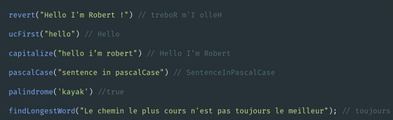

1. Créer une fonction revert(str) qui inverse une chaîne de caractère et la retourne
2. Ecrire une fonction ucFirst(word) qui transforme la première lettre d’une chaine de caractère en majuscule
3. Ecrire une fonction capitalize(str) qui transforme chaque première lettre de chaque mot en majuscule
4. Ecrire une fonction pascalCase(str) qui transforme chaque première lettre de chaque mot en majuscule et
supprime les espaces
5. Créer une fonction palindrome(str) qui vérifie si un mot est un palindrome et retourne un booléen
6. Écrire une fonction findLongestWord(str) qui permet de trouver le mot le long plus d’une chaîne de caractère

